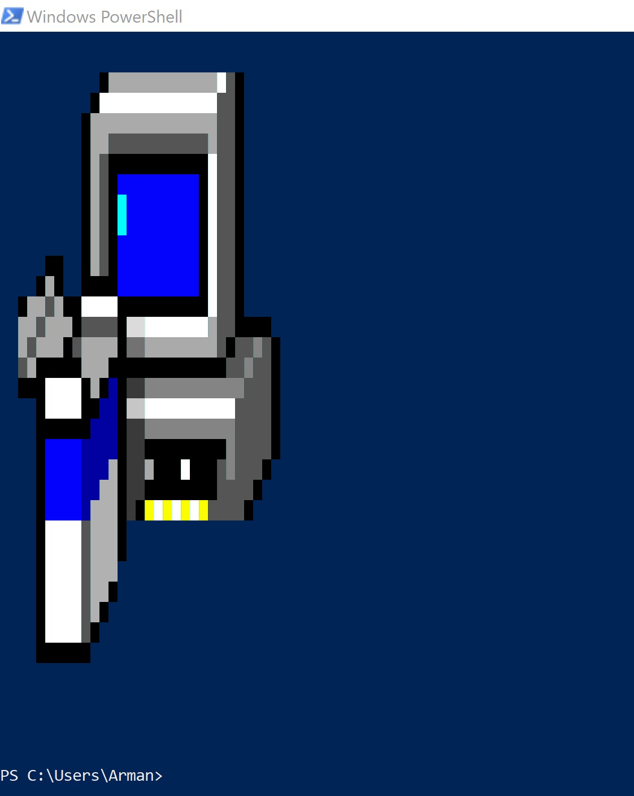

# PixShell
Use this PowerShell script to draw images in the PowerShell terminal.

**Note** : May not work with the older versions of the PowerShell.

## Usage
`& .\pixshell.ps1 <path> <ratio (optional)>`

## Parameters
* Path: This is a string indicating the location of the image. Path can be local (e.g C:\Users\img.jpg) or online (e.g. www.image.com\img.jpg)

* Ratio: An integer indicating the subsampling of the image. For example ratio of 10 means that the script divides the width and height of the image by 10. So, in both width and height, it draws a pixel and ignores the next 9 pixels, then draws the 10th pixel and so on. Default ratio is 10.

## Notes
* For large images use large ratio's.
* Large ratio's result in smaller image outputs in the terminal.
* Supports PNG images without background (alpha = 0)
* Works perfect with small/medium images.

## Samples

